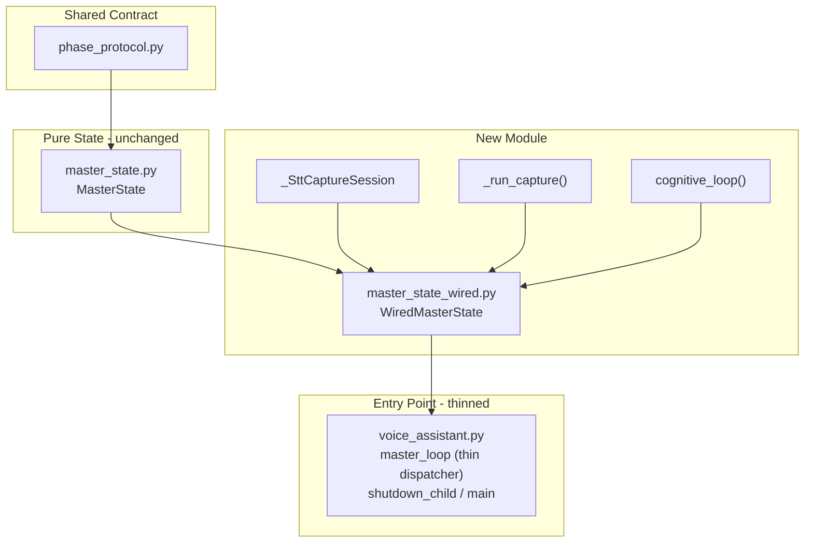

# Plan: wired-master-state-subclass

**Session date:** 2026-04-07

---

## Architecture



The base class (`MasterState`) stays pure and testable — zero changes. A new subclass (`WiredMasterState`) in a separate module absorbs the side-effect sequences currently in `master_loop`. Helper functions/classes that `voice_assistant.py` no longer calls directly move to the new module. `master_loop` becomes a thin message dispatcher.

---

## New module: `assistant/master_state_wired.py`

### What moves here from `voice_assistant.py`

These items move in their current form. Annotate with `# TODO:` where cleaner expression is possible later (see Extension Paths below).

- **`_DG_KEEPALIVE_INTERVAL`** constant (line 79)
- **`_SttCaptureSession`** class (lines 86-101) — unchanged
- **`_run_capture()`** function (lines 104-193) — unchanged; stays module-level (thread target)
- **`cognitive_loop()`** function (lines 217-231) — unchanged; stays module-level, called by subclass
- **`_arm_stt_session()`** (lines 199-214) — becomes **method** `WiredMasterState._arm_stt_session()`, drops the `state`, `ring_reader`, `dg_client` params (uses `self`)

### Class: `WiredMasterState(MasterState)`

#### Post-construction wiring methods

Follow RecorderState's pattern: one `set_*` per worker, called after construction.

```python
def set_pipe(self, pipe) -> None: ...
def set_agent(self, agent) -> None: ...
def set_tts(self, tts) -> None: ...
def set_ring_reader(self, ring_reader) -> None: ...
def set_dg_client(self, dg_client) -> None: ...
```

Annotate the post-construction pattern as a refactor candidate: all workers are constructed before the state in the current code, so constructor injection is a viable future simplification.

**Ref strength disposition (all strong today):**

- `_pipe` — strong. Long-lived; same precedent as `RecorderState._pipe`.
- `_agent` — strong. Lives for entire `master_loop`; no back-reference to state (no cycle).
- `_tts` — strong. Same rationale as agent.
- `_ring_reader` — strong. Wrapper over SharedMemory; no cycle.
- `_dg_client` — strong. Stateless client; no cycle.

None of today's workers hold a reference back to the state object, so no cycle risk exists. Annotate: weakrefs become appropriate if workers gain a back-reference to state, or if worker lifetime becomes shorter than master process lifetime.

#### Overridden methods (call `super()` for guard, then add side effects)

**`on_wake_detected(self, write_pos, score, keyword) -> bool`**
- `super().on_wake_detected(...)` for guard (returns False if processing or wrong phase)
- `self._agent.prepare()`
- `self.note_agent_prepare()`
- `self._pipe.send({"cmd": "SET_CAPTURE"})`
- `self.mark_stt_pending_after_set_capture()`
- Logging (WAKE_DETECTED score/keyword) moves here from loop

**`on_state_changed(self, new_phase) -> StateChangeResult`**
- `res = super().on_state_changed(new_phase)` for phase tracking + exit/entry hooks
- If `res.accepted and self.stt_arm_ready`: call `self._arm_stt_session()`
- If `res.accepted and self.capture_phase_without_pending_stt`: log warning
- Return `res`

**`on_vad_stopped(self, write_pos) -> bool`**
- `super().on_vad_stopped(...)` for guard (returns False if not speaking or not capture)
- `self.finalize_capture()` -> transcript
- `self._pipe.send({"cmd": "SET_IDLE"})`
- `self.begin_processing()`
- Call `cognitive_loop(transcript, self._agent, self._tts)` in try/except/finally
- `self.end_processing()` in finally
- `self._pipe.send({"cmd": "SET_WAKE_LISTEN"})` in finally
- Logging moves here from loop

#### Not overridden

- **`on_vad_started()`** — the loop currently just logs one line. Log stays in the thin dispatcher; no override needed.
- **`teardown_capture()` / `finalize_capture()` / `arm_stt()`** — base class implementations are sufficient. The subclass calls them (inherited), does not override.
- **`on_state_changed()` entry/exit hooks** (`_run_exit_hook`, `_run_entry_hook`) — base class handles these. No override.

#### New methods

**`_arm_stt_session(self) -> None`**
- Migrated from module-level `_arm_stt_session(state, ring_reader, dg_client)`
- Creates `_SttCaptureSession`, calls `self.arm_stt(cap)`, starts `_run_capture` thread using `self._ring_reader` and `self._dg_client`

**`close(self) -> None`**
- Owns worker lifecycle teardown (decision: subclass owns lifecycle)
- Calls `self.teardown_capture()`
- Calls `self._agent.close()` if set
- Calls `self._tts.close()` if set

### Imports for the new module

```python
import threading
import time
from loguru import logger
from deepgram.core.events import EventType
from agent_session import AgentSession, AgentError
from tts_backends import TTSBackend
from audio_shm_ring import CHANNELS, SAMPLE_RATE, AudioShmRingReader
from master_state import MasterState, StateChangeResult
```

---

## Changes to `voice_assistant.py`

### Removed code

- `_DG_KEEPALIVE_INTERVAL` constant
- `_SttCaptureSession` class
- `_run_capture()` function
- `_arm_stt_session()` function
- `cognitive_loop()` function

### Import changes

Removed (no longer needed):
- `threading`
- `from deepgram.core.events import EventType`
- `AgentSession`, `AgentError` from `agent_session`
- `CHANNELS`, `SAMPLE_RATE` from `audio_shm_ring`
- `MasterState` from `master_state`

Added:
- `WiredMasterState` from `master_state_wired`

Retained (still used for construction / config / shutdown):
- `os`, `sys`, `time`
- `multiprocessing` (Pipe, Process, SharedMemory)
- `pathlib.Path`, `dotenv`, `loguru`
- `DeepgramClient` from `deepgram` (construction)
- `configure_logging`
- `CursorAgentSession` from `agent_session` (construction)
- `TTSBackend`, `CartesiaTTS`, `ElevenLabsTTS`, `DeepgramTTS` (config + construction)
- `SHM_NAME`, `SHM_SIZE`, `AudioShmRingReader` from `audio_shm_ring` (construction)
- `recorder_child_entry`

### `master_loop` — thin dispatcher

Construction section creates workers and wires the subclass:

```python
state = WiredMasterState()
state.set_pipe(pipe)
state.set_agent(agent)
state.set_tts(tts)
state.set_ring_reader(ring_reader)
state.set_dg_client(dg_client)
```

The `while True` dispatch loop becomes:

```python
while True:
    msg = pipe.recv()
    cmd = msg["cmd"]

    if cmd == "STATE_CHANGED":
        state.on_state_changed(msg["state"])
    elif cmd == "WAKE_DETECTED":
        if not state.on_wake_detected(msg["write_pos"], msg["score"], msg["keyword"]):
            logger.warning("[master] WAKE_DETECTED ignored (processing={} phase={})",
                           state.processing, state.phase)
    elif cmd == "VAD_STARTED":
        if state.on_vad_started(msg["write_pos"]):
            logger.info("[master] VAD_STARTED    write_pos={}", msg["write_pos"])
    elif cmd == "VAD_STOPPED":
        state.on_vad_stopped(msg["write_pos"])
    elif cmd == "SHUTDOWN_COMMENCED":
        logger.info("[master] child initiated shutdown")
        return
    elif cmd == "SHUTDOWN_FINISHED":
        logger.info("[master] child finished without SHUTDOWN_COMMENCED -- exiting cleanly")
        return
    elif cmd == "ERROR":
        logger.error("[master] ERROR from child: {}", msg.get("msg", "?"))
```

The `finally` block simplifies to:

```python
finally:
    state.close()
```

READY handshake and initial `SET_WAKE_LISTEN` stay in `master_loop` (loop-level protocol, not state concern).

`shutdown_child()` and `main()` are unchanged.

---

## No changes to `master_state.py`

The base class is unchanged. `test_master_state.py` is unchanged. The pure-state / zero-dependency property is preserved.

---

## Documentation updates

Update `assistant/AGENTS.md` file index:
- Add row for `master_state_wired.py` describing `WiredMasterState`
- Update `voice_assistant.py` description (now thin dispatcher + shutdown + main)
- Update `master_state.py` description to note it is the base class for `WiredMasterState`

---

## Extension paths (annotate, do not implement)

These should appear as `# TODO:` or `# FUTURE:` comments at the relevant code sites:

1. **Constructor injection** — post-construction `set_*` wiring could be replaced with constructor args, since all workers are constructed before the state today.
2. **Weakref conversion** — if workers gain back-references to state or become shorter-lived, switch specific refs from strong to weakref.
3. **`_run_capture` as method** — currently stays module-level (thread target). Could become a method if the threading model changes.
4. **`cognitive_loop` as method** — currently stays module-level. Could become a method to access state directly rather than receiving workers as args.
5. **RecorderState back-port** — extract a pure `RecorderStateBase` from `RecorderState`, mirroring the `MasterState`/`WiredMasterState` split. Tracked as option, not scheduled.

---

## Testing strategy

- **`test_master_state.py`** — unchanged; validates base class in isolation
- **Pi integration** — the subclass is tested via Pi smoke runs (same validation as today: wake-to-response cycle, clean shutdown, multi-turn)
- **Behavioral equivalence** — the refactoring must not change observable behavior; the same log lines should appear in the same order during a Pi run
